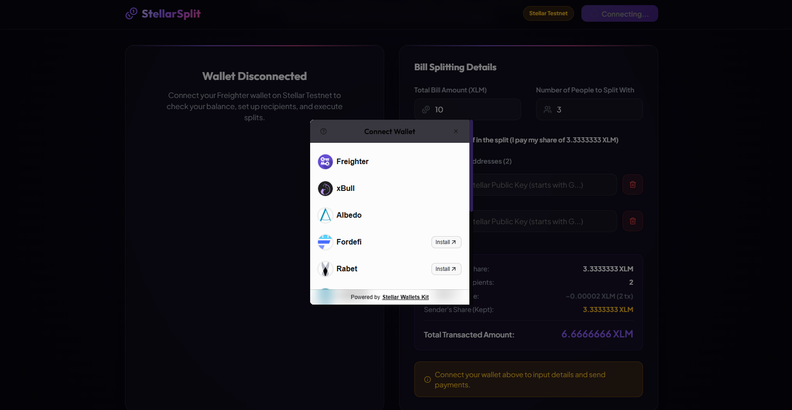
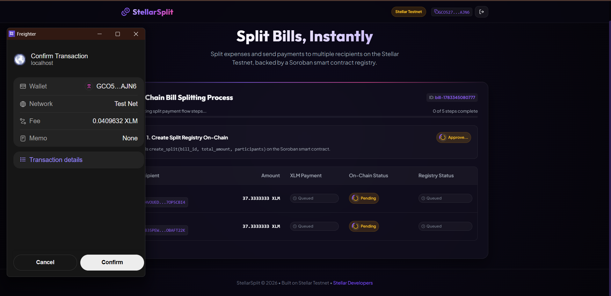
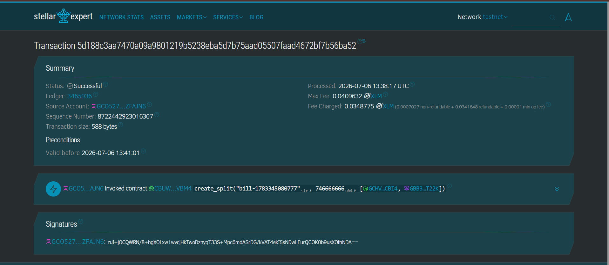

# StellarSplit - Smart Split Bill Calculator (Level 2 - Yellow Belt)

A beautiful, high-performance decentralized web application (dApp) built on the Stellar Testnet. This upgraded version meets all **Level 2 - Yellow Belt** requirements, supporting multi-wallet integration, robust error handling, and end-to-end integration with a custom Soroban smart contract registry deployed on Testnet.

---

## 🌟 Level 2 - Yellow Belt Features

### 1. Multi-Wallet Integration
- Migrated from direct Freighter integration to the unified `@creit.tech/stellar-wallets-kit`.
- Supports multiple wallet choices out-of-the-box: **Freighter**, **xBull**, **Albedo**, and **Lobstr**.
- Displays a clean, customizable wallet selection modal upon clicking "Connect Wallet".
- Fully supports connection persistence across refreshes.

### 2. Soroban Smart Contract Registry Integration
- Integrates with the deployed Testnet contract ID: `CBUWAF5KWSTDVIGR2SW4KX5KQ44ESSLHFIQTZM5N4HYHHMZ7RF7IVBM4`.
- **Initialization**: Automatically calls `create_split(bill_id, total_amount, participants)` on-chain before processing payments.
- **Verification**: Sequentially calls `mark_paid(bill_id, recipient)` on-chain after each successful XLM payment.
- **Real-Time Polking**: Periodically polls the contract using `get_split_status(bill_id)` simulation to check and display the real-time payment registry state (`Paid ✅` or `Pending`).

### 3. Granular Error Handling (3 Distinct Error Types)
- **Error Type 1 (Wallet Not Installed/Found)**: Clear warning if a user selects a wallet extension that is not installed or available.
- **Error Type 2 (User Rejection)**: Catch-all handling if the user rejects a signature request in the wallet modal or connection popup.
- **Error Type 3 (Insufficient Balance)**: Auto-validated client-side before submission (checking bill total + estimated fees against account balance) and caught during simulation/execution, with a direct link to the Stellar Friendbot for quick funding.
- Each error is displayed in the UI with a distinct visual error card or inline status badge.

### 4. Sequential & Visual Progress pipeline
- Comprehensive step-by-step progress tracking:
  - **Step 1**: On-Chain Split Bill Registry Initialization (`create_split`)
  - **Step 2**: Individual XLM Payment Submission (`send_payment`)
  - **Step 3**: On-Chain Payment Registry Update (`mark_paid`)
- Dynamic progress bar showing the fraction of completed operations (out of `1 + 2 * N` total steps).
- Direct links to the **Stellar.expert** explorer for all transaction hashes (smart contract operations and payment transfers).

---

## 🛠️ Tech Stack

- **Frontend Framework**: React 19 (via Vite)
- **Language**: TypeScript
- **Styling**: Vanilla CSS (Custom Cosmic Design System with Glassmorphism, Backdrop Blurs, and Micro-Animations)
- **Stellar Libraries**:
  - `@stellar/stellar-sdk` (v16.0.1) for transaction building, Soroban RPC, and Horizon operations
  - `@creit.tech/stellar-wallets-kit` (v2.5.0) for multi-wallet integration
- **Icons**: `lucide-react`

---

## 🚀 Setup & Installation

### 1. Clone & Install
```bash
git clone <repository-url>
cd StellarSplit
npm install
```

### 2. Run Local Development Server
```bash
npm run dev
```
Open your browser and navigate to `http://localhost:5173`.

### 3. Fund Your Testnet Account
Ensure your connected wallet is set to **Testnet** and funded. If you need funds:
1. Copy your public key (address) starting with `G...`
2. Go to the [Stellar Laboratory Friendbot](https://laboratory.stellar.org/#friendbot) to fund it with 10,000 testnet XLM.

---

## 📝 Smart Contract Interface
The Soroban smart contract is deployed on Testnet at:
`CBUWAF5KWSTDVIGR2SW4KX5KQ44ESSLHFIQTZM5N4HYHHMZ7RF7IVBM4`

### Key Methods Utilized:
1. `create_split(bill_id: String, total_amount: u64, participants: Vec<Address>)`
2. `mark_paid(bill_id: String, participant: Address)`
3. `get_split_status(bill_id: String) -> Option<SplitStatus>`

### Verifiable Contract Call:
- **Transaction Hash**: [`5d188c3aa7470a09a9801219b5238eba5d7b75aad05507faad4672bf7b756ba52`](https://stellar.expert/explorer/testnet/tx/5d188c3aa7470a09a9801219b5238eba5d7b75aad05507faad4672bf7b756ba52)

### Verifiable Payment Receipts:
- **Receipt 1 (Payment 1)**: [`c11c8400251c22e71db69071924186e99aa30b7843a4c1e92994c5a367acd84c`](https://stellar.expert/explorer/testnet/tx/c11c8400251c22e71db69071924186e99aa30b7843a4c1e92994c5a367acd84c)
- **Receipt 2 (Payment 2)**: [`d714ea3ed3a8b1b1ae8ca1bb68e75e7b5970c09d5aca615745bf37159c08e8fa`](https://stellar.expert/explorer/testnet/tx/d714ea3ed3a8b1b1ae8ca1bb68e75e7b5970c09d5aca615745bf37159c08e8fa)

---

## 📸 Screenshots & Explorations
1. **Wallet Selection Modal**:
   

2. **On-Chain Process Monitor**:
   

3. **Stellar.expert Contract Call Verification**:
   
